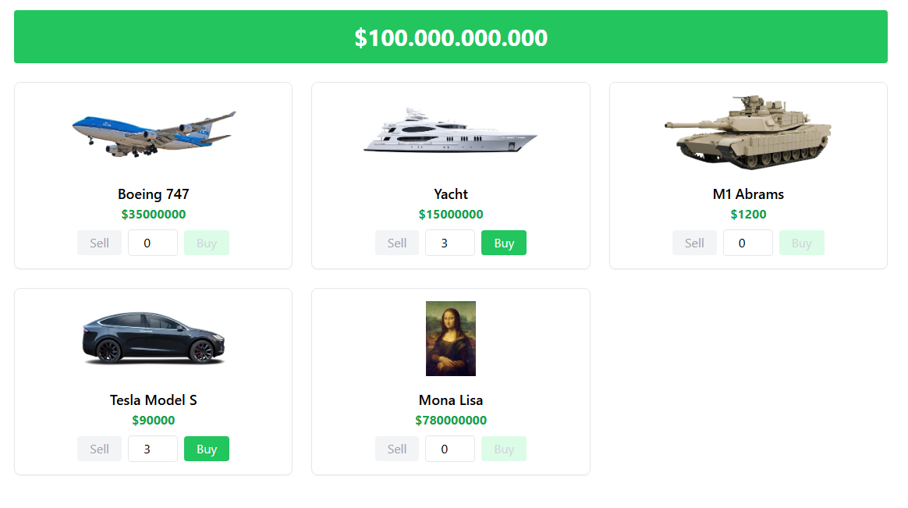

# 💸 Spend Bill Gates' Money

A fun and responsive web app inspired by [neal.fun/spend](https://neal.fun/spend), where you get $100 billion and try to spend it on different items!

## 🧠 Features

- 💰 Starts with a $100,000,000,000 balance
- 🛒 Buy and sell from a list of products
- 🔢 Manual quantity input for buying/selling
- 🚫 "Sell" button disabled if you own none
- 🚫 "Buy" button disabled if you can't afford it
- 📱 Fully responsive design (mobile-friendly)
- 📦 Cart summary (optional add-on)

## 📸 Screenshot



## 🔧 Tech Stack

- **HTML5**
- **Tailwind CSS** (via CDN)
- **React** (optional for SPA version)

## 🗂️ Project Structure

```
/public
  /images
    bigmac.png
    flipflops.png
    ...
/src
  App.jsx
  /components
    ProductCard.jsx
  /data
    products.js
index.html
```
