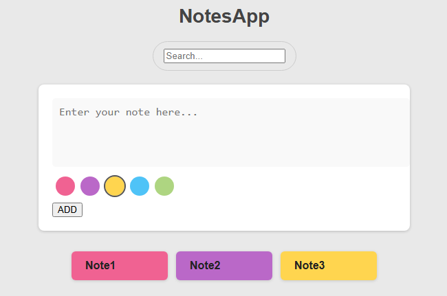
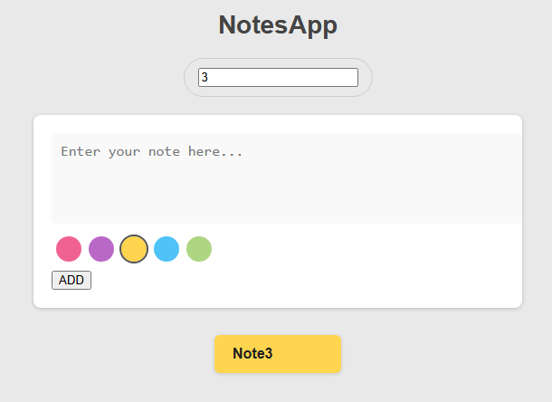

# 📝 NotesApp

A simple and colorful note-taking application built with **React** (also available in Vanilla JS). It allows users to:

- Write and save notes
- Choose a color for each note
- Filter existing notes using a search bar

## ✨ Features

- ✅ Add new notes with a selected color
- 🎨 Choose from 5 different colors
- 🔍 Filter notes dynamically based on the content
- 🧠 Simple and intuitive UI
- 📱 Responsive design (desktop & mobile friendly)

## 🚀 Demo

Here’s a preview of the application:





## 🛠 Technologies Used

- **React** (for the main implementation)
- **HTML/CSS** (Vanilla version also included)
- **JavaScript (ES6)**

Then visit: [http://localhost:5173](http://localhost:5173)

## 📂 Folder Structure

```
/src
  ├── App.jsx
  ├── App.css
  └── main.jsx
```
