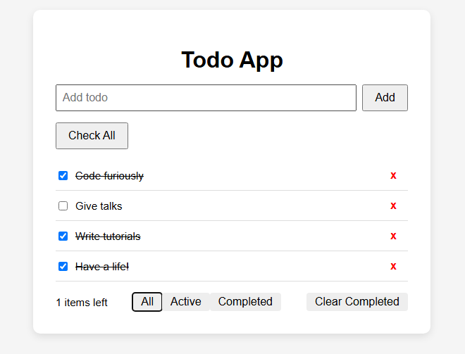

# React TypeScript Todo App

A lightweight and clean Todo application built with **React** and **TypeScript**. It supports adding, deleting, filtering, marking todos as completed, and storing them in `localStorage` for persistence.

---

## 🚀 Features

- ✅ Add, delete, and toggle todos
- 🎯 Filter by **All**, **Active**, or **Completed**
- 📦 Persistent with `localStorage`
- 📌 "Toggle all" functionality
- 🧹 Clear completed todos
- 💨 Lightweight and fast
- 🧑‍💻 Written in TypeScript

---

## 🧪 Tech Stack

- [React](https://reactjs.org/)
- [TypeScript](https://www.typescriptlang.org/)
- [Vite](https://vitejs.dev/) for fast development setup

---

## 📦 Getting Started

### 1. Install dependencies

```bash
npm install
```

### 2. Run the development server

```bash
npm run dev
```

Open your browser and go to `http://localhost:5173`

---

## 📁 Project Structure

```
src/
├── App.tsx         # Main app component
├── App.css         # Styling
├── index.tsx       # React entry point
└── types.ts        # Type definitions
```

---

## 📷 Screenshots

> 

---

## 🛠️ To-Do (Improvements)

- [ ] Add edit functionality for todos
- [ ] Use Context API or Zustand for state management
- [ ] Add animations with Framer Motion
- [ ] Add unit tests with Vitest or Jest
