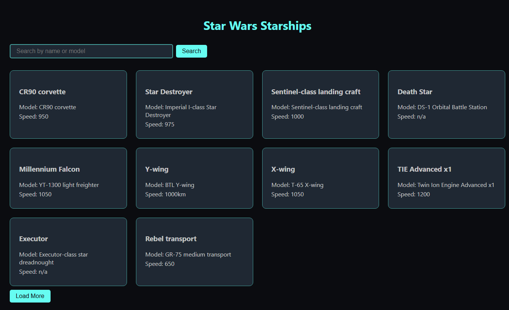

# 🚀 Star Wars Starships App

A modern and responsive **React + TypeScript** app that explores the legendary starships from the Star Wars universe using the [SWAPI](https://swapi.dev/) API.


---

## ✨ Features

- 🔭 List starships from the Star Wars API
- 🔎 Search starships by **name** or **model**
- 📄 View detailed information about each starship:
  - Model
  - Manufacturer
  - Crew & Passengers
  - Speed & Cargo Capacity
- 📥 Load more results with **pagination**
- 🌓 Dark-themed, responsive UI
- ⚡ Built with Vite, Axios, React Router v6+

---

## 📸 Preview



---

## 🛠️ Tech Stack

| Tech            | Description                  |
| --------------- | ---------------------------- |
| ⚛️ React        | UI Library                   |
| 🧑‍💻 TypeScript   | Static typing                |
| 🧭 React Router | Routing between pages        |
| 📡 Axios        | HTTP client for API requests |
| ⚡ Vite         | Fast dev environment         |

---

## 📦 Installation

1. **Install dependencies**

```bash
npm install
```

2. **Run the app**

```bash
npm run dev
```

Open [http://localhost:5173](http://localhost:5173) to view it in your browser.

---

## 🧭 Routes

| Path            | Description            |
| --------------- | ---------------------- |
| `/`             | Starship list & search |
| `/starship/:id` | Starship detail page   |

---

## 📁 Project Structure

```
src/
├── components/       # Reusable components
├── pages/            # Page-level views
├── types/            # TypeScript types
├── App.tsx           # App with Router
├── App.css           # Global styling
└── main.tsx          # Entry point
```

---

## 🌌 Credit

Built using the [Star Wars API (SWAPI)](https://swapi.dev/)

---

> May the source be with you. 🛸
