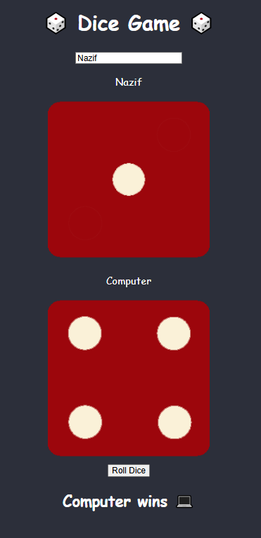

# 🎲 Dice Game in React

A fun and interactive dice game built with **React** where a player competes against the computer. Inspired by classic board game aesthetics, the game features smooth animations, a modern UI, and customizable player names.

## 🚀 Features

- 🎯 One-round dice roll between Player and Computer
- ⏳ Animated dice rolling for 3 seconds
- 🎨 Stylish dark-themed UI with red dice and neon accents
- 🤝 Win/Lose/Draw results displayed after each round
- 🧑‍💻 Editable player name
- 🔁 Shuffle button with dynamic state (disabled while rolling)

## 🖥️ Screenshots



## 📦 Tech Stack

- React (Functional Components)
- CSS (Custom styling with animations)
- `useState` and `setInterval` for state & animation

## 📁 Project Structure

```
src/
├── components/
│   ├── Dice.jsx          // Renders a single dice face
│   ├── Result.jsx        // Displays game result
│   └── UsernameInput.jsx // Input field to change player name
├── App.jsx               // Main game logic and layout
├── App.css               // Styling for all components

```

## 🧠 How It Works

1. Click the green "Roll Dice" button.
2. Both dice will roll randomly for 3 seconds.
3. Final values are generated.
4. The result is shown:
   - Player wins
   - Computer wins
   - Draw

## ✏️ Customization

You can easily customize:

- Dice faces (images or styles)
- Roll time duration
- Add sound effects or score tracking
- Make it multiplayer
